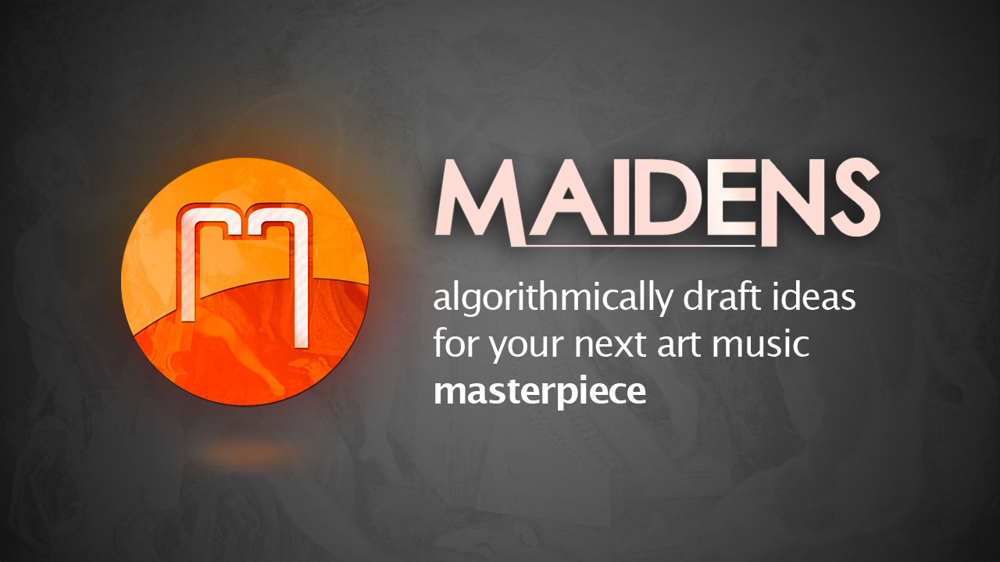
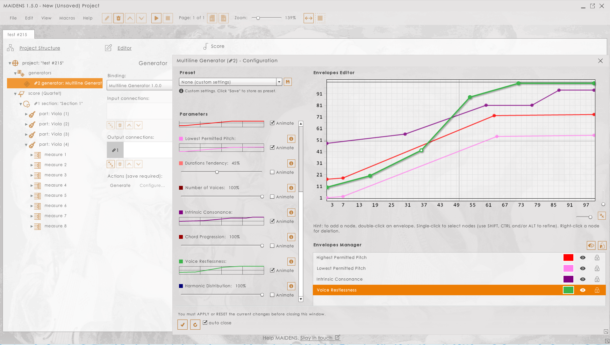
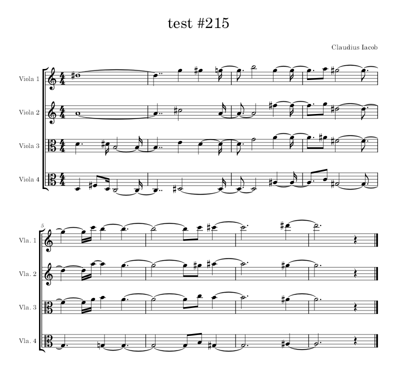

# MAIDENS
###### "Algorithmically draft ideas for your next art music masterpiece"
MAIDENS is a [Computer Aided Algorithmic Composition](https://scholar.google.ro/scholar?q=Computer+Aided+Algorithmic+Composition&hl=ro&as_sdt=0&as_vis=1&oi=scholart) software program aimed at contemporary art music composers. They can use it to **quickly prototype musical ideas** or to explore new realms of artistic expression.

## The problem
Music composition has very little to do with what is commonly thought of, especially on its classical side. Writing art music is an immense struggle. The moments when one musical phrase calls for another, and the entire piece grows organically like a plant from a seed are rather rare, and short lived. Most of the time we, as composers, know very little of what will become of the music that we started writing. If we're lucky we might have a theme or a chords progression, but otherwise we might just as well only have a *very remote idea* of how our music should proceed.

And by *idea*, I mean something along the lines of:

> it should go from peacefully and quiet to dramatic and ultimative, and then hit a plateau of sustained tension, and then progressively calm down.

Humble as it is, this is still the happy case where the composer has *any idea* whatsoever on what his music should be. Far more commonly, we have nothing.  We somehow come with a fragment and then blindly try to imagine *sequel*s for it, like:

> what if I would go up, and maybe add in some dissonance, will that do? What if I add a choral? Will it help if it starts faster and slows down little by little? Should I add or remove voices? Or maybe add first and then remove?

The issue with all this "musical probing" is that it consumes an enormous amount of time. Musical hypotheses are twice as hard to proof as, say, math hypotheses because they reclaim *in-context aurally checking*. Music is essentially impossible to judge upfront. There is no way of knowing whether a musical idea sounds right except *by actually composing and playing it* in the current musical context. Gifted composers would be able to make up an idea outright on the piano, but that too takes up time. Besides, unless that composer is also a fast writer, its findings might prove short lived.

**The bottom line is that the process is ineffective**: you end up sketching tens of ideas you then toss as unfit, and when you look at the time it's been yet another day and the final bar of your piece is not significantly closer, but the deadline is. And this leads to stress, and stress leads to frustration, and frustration eventually leads to **creator bloc**.

## MAIDENS Solution
### MAIDENS software steps in by letting you validate musical ideas in a matter of seconds not hours.
The only condition is that you *clearly understand what you are trying to achieve*. If asked, would you be able to describe your musical idea as a simple process? Such as: 
> over the next eight measures, I want four violas that start polyphonically in the lower register and then slowly climb to the higher register while also moving from dissonance to consonance and from polyphony to harmony.

In MAIDENS this is as easy as setting up an eight measures four violas score and drawing control curves for _pitch_, _consonance_ and _note attack_ related parameters.

And then you click **Generate**, and in less than one minute you have a piece of music that at least _conforms_ to your requirements. The music that you'll get is highly unlikely to be usable as is, but this was never the idea. _The idea was for you to quickly get a **musical prototype**_, a reasonable utterance of a music composition _process_. You are not expected to validate the prototype, but the process it relies upon.

### Now it only costs you hours, not days, to craft a blueprint for your entire piece.
Was it a bad idea to proceed from lower register to higher register? Redraw the parameters and **generate** again. Does music seem too weak because of using consonance in the harmony section? Redraw the _consonance_ control curve and **generate** again. Once you find a suitable course of action for your music you can start to actually compose it, secured in the belief that you chose the best of all available alternatives.

As an added bonus, you now have a rather detailed work plan to follow along, and maybe some interesting **artefacts** you collected during all music generation sessions. Maybe you like them and will use them as such, or maybe they fuel your musical imagination and you'll morph them into something of great effect. Or, who knows, maybe you want to follow in the footsteps of Xenakis and Varèse and try some algorithmic composition yourself. 

> **Anyhow, you now have a way to quickly prototype your musical ideas into something tangible.** You can now actually validate or dismiss a musical idea _by the way it sounds_. And in just a few clicks.

## Getting the Software
MAIDENS is an open source software program that you can use free of charge. To install, you have two options:
- download the latest pre-built distribution package for your operating system from the [Releases](https://github.com/ciacob/maidens/releases) section;
- build MAIDENS yourself from source, provided that you are familiar with building Adobe/Harman AIR applications.

> Note that paying [Patreon supporters](https://www.patreon.com/maidens_app) receive added benefits, such as nightly builds, bugfix priority and email based support for using the application to its full potential.

## Using the Software
Under normal circumstances, using MAIDENS revolves around these five steps:
1. setup a new score having the needed instruments and number of measures;
2. bind a *generator* to the score's first section;
3. configure the generator then click its **Generate** button;
4. observe and audition the output;
5. repeat steps **3** and **4** until you get a version that you can base your decisions on. 

If it helps, you may also use MAIDENS' minimal built-in *score editor*, to make in-place small adjustments to generated content. Also, if you find the output worth keeping (in full or in part), export it to an interchange format, such as MIDI or MusicXML, and import it back in your favorite score notation or DAW software for further processing.

> You can save time by using **Templates** and **Presets**, so that you can easily reclaim score setups and generator configurations you frequently use.

There is also an extensive online [program documentation](https://maidens.claudius-iacob.eu/cms/doc/) that you are encouraged to read (in fact, you should if you want to get the most from MAIDENS).

